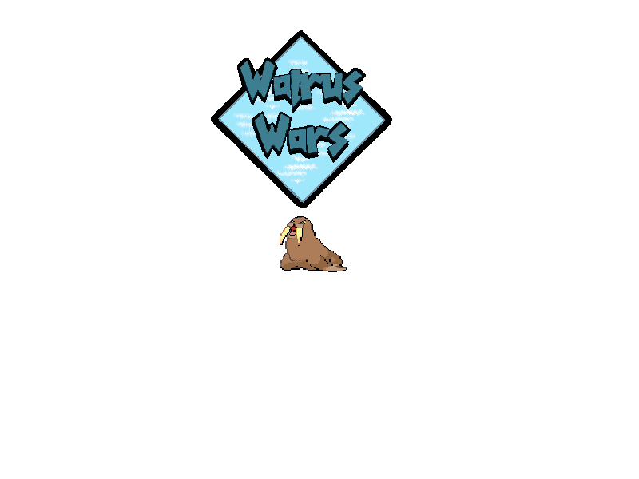

# Walrus Wars
A majestic battle of desperation on a shrinking arctic ice flow in the modern age of global warming.

## installation instructions:
- Prerequisites must be installed: cmake and SFML

1. ```git clone https://github.com/LaGamma/WalrusWars/```
2. ```cd WalrusWars/application```
3. ```mkdir Release```
4. ```cd Release```
5. ```cmake ..```
6. ```make```
7. ```./application```



[Software Architecture](https://www.draw.io/?lightbox=1&highlight=0000ff&edit=_blank&layers=1&nav=1&title=walruswars#Uhttps%3A%2F%2Fdrive.google.com%2Fa%2Femail.wm.edu%2Fuc%3Fid%3D1JHP4jRh6C4aZxVL00ZnhryCHLmA5V09V%26export%3Ddownload)

team repo for CS437
https://drive.google.com/drive/folders/0ABzZGHm_5xqQUk9PVA
